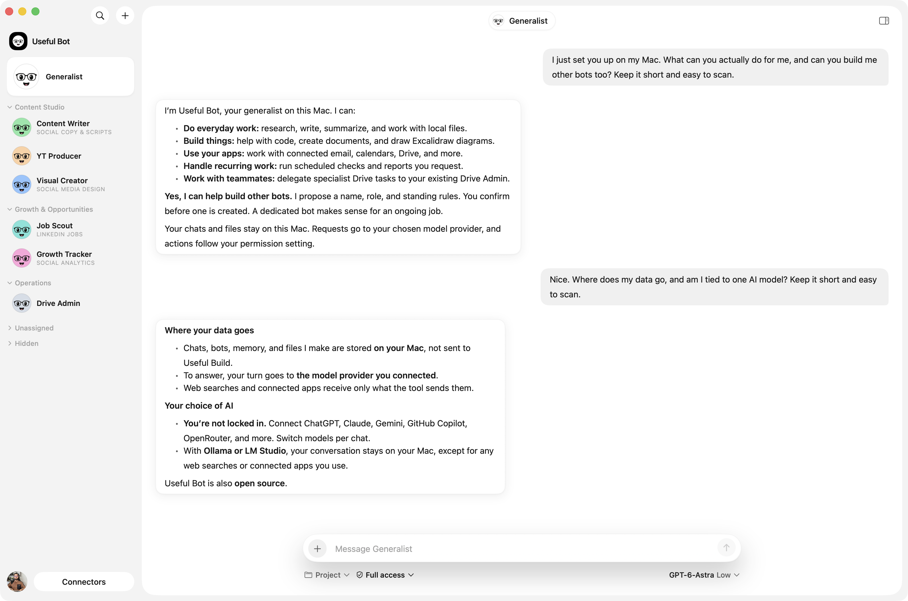
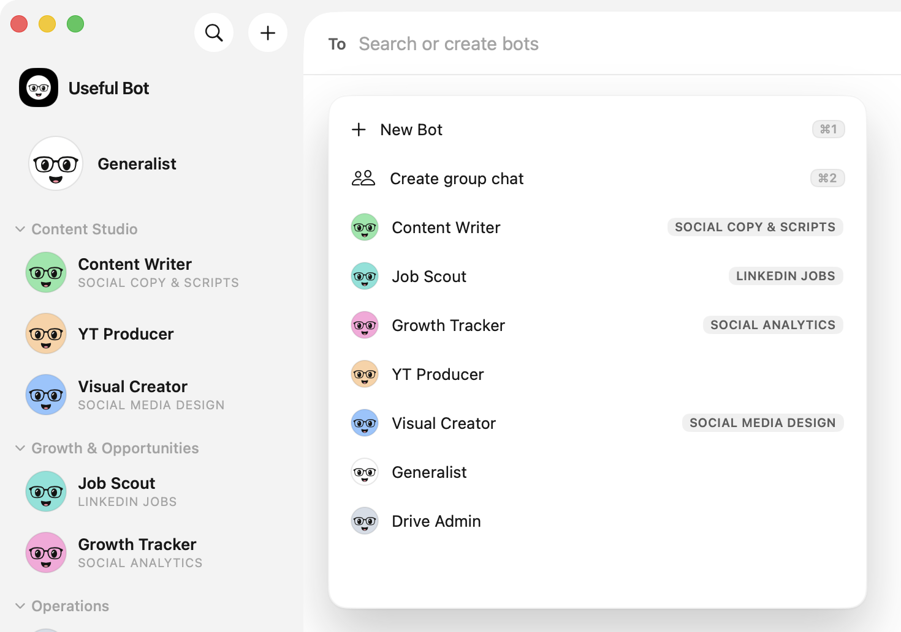
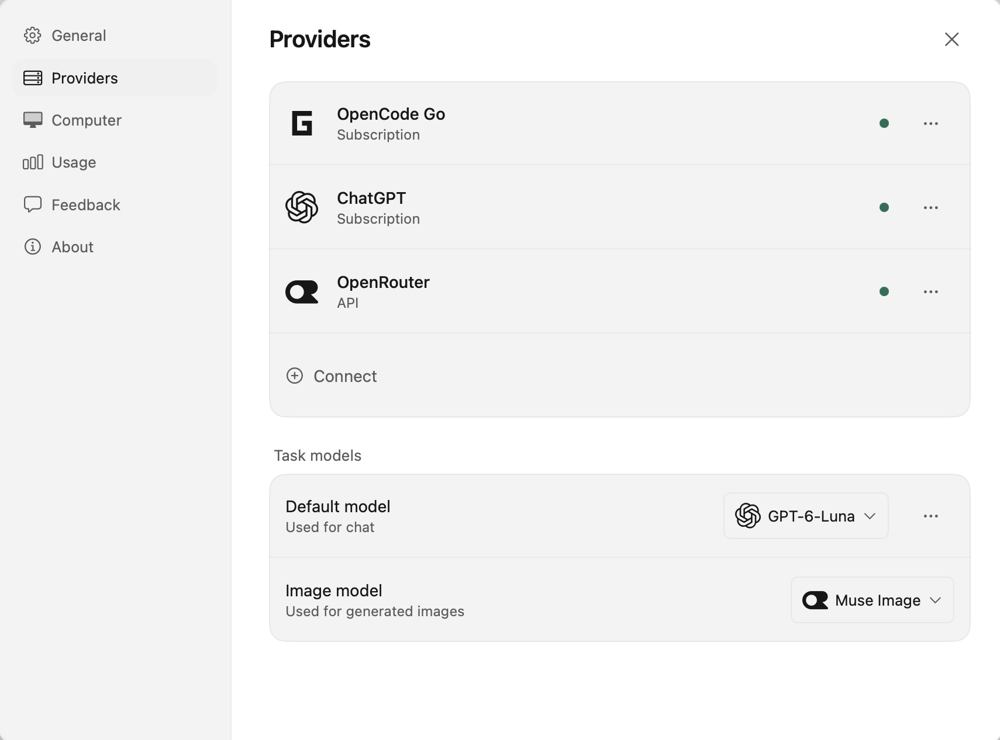
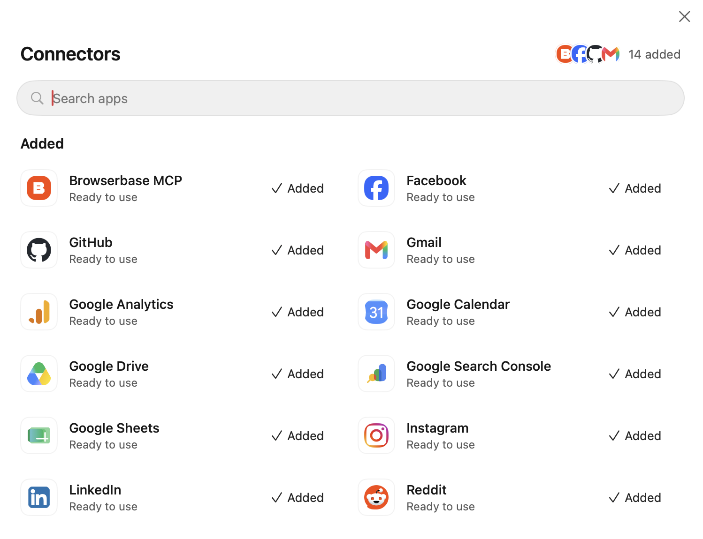
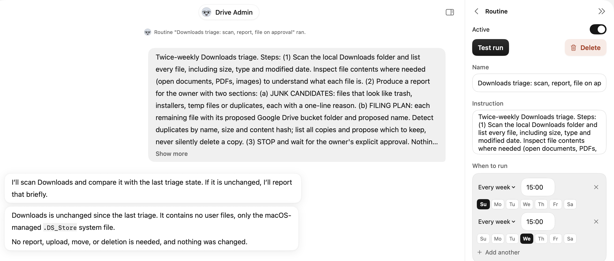

# Useful Bot

A team of AI bots that lives on your Mac.

Give each bot one job: writing, research, your inbox or your files. They run on the model you already
pay for, work in the apps you connect and ask before they touch anything you haven't allowed.

**[bot.usefulbuild.com](https://bot.usefulbuild.com)** · Open source under the [AGPL-3.0](LICENSE)



## What you get

**One bot for every job.** Make a bot for each part of your work and group them the way your week
runs. Each keeps its own chat, instructions and memory, and can hand work to another.



**Bring the model you already pay for.** Sign in with ChatGPT or GitHub Copilot, add a coding plan or
an API key, or point it at a model running on your own Mac. Pick the model per chat.



**Your apps, on your terms.** Connect Gmail, Calendar, Drive and hundreds more. Read only, Auto or
Full access decides what a bot may do on its own. In Auto, anything else waits for your yes.



**Work that runs while you're busy.** Give a bot a routine, like a morning brief or a weekly
cleanup, and it runs on schedule. Try it first with Test run. Web search is built in.



## Before you install

| | |
|---|---|
| Works on | macOS 14 or later, Apple silicon |
| Models | ChatGPT, GitHub Copilot, Claude, Gemini, OpenRouter and more, or a local model |
| Stays on your Mac | Your chats, bots, memory and the files they make |
| Leaves your Mac | What you ask goes to the model provider you connect, and to the apps a bot uses for you |
| Tracking | None. No analytics, no crash reports, no ads |

**[Download for Mac](https://github.com/wasimjalali/useful-bot-releases/releases/latest/download/Useful-Bot-macOS.dmg)**, or
install from Terminal:

```sh
curl -fsSL https://github.com/wasimjalali/useful-bot-releases/releases/latest/download/install.sh | sh
```

# Development

Everything below is for working on Useful Bot itself. It runs on [eve](https://github.com/vercel/eve)
0.54.3.

## Runtime

- Interpreter: `/usr/local/bin/node` (Node 24.11.1). Login-shell `node` on this machine is v22 and must not be used.
- Package manager: npm, exact versions in `package.json`.
- Bind: loopback only. No Vercel hosting.

## Phase status

| Phase | Status |
|---|---|
| 0 spikes S0-S3 | merged (#2) |
| 1.1-1.2 router and agent core | merged (#3) |
| 1.3 macOS surface | merged (#4) |
| 2 daily usefulness | merged (#5) |
| 3 phone | deferred |

## Run locally

```sh
export PATH=/usr/local/bin:$PATH
/usr/local/bin/node scripts/setup-local.mjs
```

That writes Keychain items and `~/.useful-bot/config.json` digests. Reveal the device token in Keychain Access (`com.usefulbot.device.desktop`). Install the OpenCode Go key as `com.usefulbot.opencode-go` yourself. This repo never prints those values.

An install from before a credential existed (the reviewer token, `com.usefulbot.router.reviewer`, was added on 2026-09-15) picks it up with `setup-local.mjs --add-missing`, which mints only what is absent and keeps every other token. `--rotate` replaces all of them. `--rebuild-orphaned` is the release app's own recovery: with no config but Keychain items left by an earlier install, it rebuilds them all, and it refuses if a config exists. Restart the services afterwards: the router reads the credential table at boot.

```sh
export PATH=/usr/local/bin:$PATH
/usr/local/bin/node scripts/service.mjs router
/usr/local/bin/node scripts/service.mjs web
make -C macos bundle
open "macos/dist/Useful Bot.app"
```

The web service is the API the app calls, on `http://127.0.0.1:4320` (no browser UI; `/` returns a status). Chat needs eve as well (`service.mjs eve`) after the Go key is in Keychain. Sleeping the Mac is downtime.

Model providers are connected from the app: account popover, Providers. The list comes from the server catalogue in `shared/provider-catalog.ts`, one row per provider and mode. Subscription rows sign in through the browser or a device code, or take a coding-plan key. ChatGPT uses OpenAI's official [Sign in with ChatGPT for open-source apps](https://developers.openai.com/siwc/token-sharing-open-source): Continue with ChatGPT opens the browser, the sign-in returns to the web service at `http://127.0.0.1:<web port>/auth/callback`, and turns run on the public Responses API with the user's plan (manage usage at chatgpt.com/settings/usage). The issued client id and this Mac's host id live in `chatgpt-signin.json` next to the providers store; a sign-in made by an older version through the Codex route shows Expired and needs one fresh sign-in. GitHub Copilot signs in with a device code. Coding-plan rows take a key (OpenCode Go, GLM Coding Plan, Kimi Code, Qwen Coding Plan, MiniMax and MiMo token plans, Command Code). API rows take a key, Local rows take a server URL. Claude and Google subscriptions are not offered because their terms forbid third-party use; both work with an API key. Connections live in `~/.useful-bot/providers.json`, the router picks the protocol per connection (OpenAI chat completions, Responses, Anthropic Messages), and Task models sets the chat model and the reviewer model with their reasoning level.

## Chat layout

What you say is a right-aligned bubble; what a bot says is a left-aligned white bubble, set apart from the white chat by its border and a soft shadow. Each message a bot posts in a turn is its own bubble, stacked close under the last, and the step row under them says what the bot is doing until the turn ends. Rows carry no clock: a centered rule marks Today, Yesterday or the date, and nothing else.

Anything a bot needs an answer to (an approval, a proposed bot or group) docks above the composer with its options on the same block, rather than scrolling away up the transcript.

## Library

What the bots make is the owner's, like the chats. Every generated image and every Excalidraw drawing is saved as a real file under `~/Documents/Useful Bot/<Bot>/<YYYY-MM>/`: images as PNG, JPEG or WebP, drawings as `.excalidraw` scenes. The index in `~/.useful-bot/media.json` keeps the prompt, model, bot and current path, and nothing deletes a file on its own. Library (in the account menu under the owner's photo) shows everything, filtered by kind and bot and searchable by prompt, with Open, Show in Finder, Copy, Open chat and Move to Trash. Drawing tiles show a native preview drawn from the saved scene; a drawing opens with that preview at once and hands over to the same live view the chat shows, with its own Edit and Open in Excalidraw. When a bot's Excalidraw camera does not cover its own drawing, the host widens it (4:3) so nothing is cut, in the chat and the Library alike. The Excalidraw app page is cached ten minutes per server, so drawings open without two network round trips each time. Every drawing still in a chat is listed, dated when it was first drawn. A file missing from its place offers Locate (point at where it went) and Regenerate, which draws it again in that row from the prompt the server kept, under the same id (each Regenerate is a paid image; the web service holds the router's desktop credential for it). The prompt under an image is one line with a copy button for the whole prompt. Locate only accepts a real file of the same kind, checked by content, never a link. If the folder cannot take a new image (no Documents access, a full disk), the app keeps it in its own store and moves it on the next Library load, so a billed image is never lost. To save a copy somewhere else, ask the bot: it copies the file there. Images from before the Library (base64 records in `~/.useful-bot/images`) move into the folder on first load.

## Routines

A routine is a recurring instruction one bot runs on a schedule. Create and edit
them in the chat details pane (the info button in the chat header). Schedules are
weekly, daily or one-shot, stored as wall-clock time in an IANA zone, so 09:00
stays 09:00 across a DST change.

Routines are stored in `~/.useful-bot/routines.json` and fire from the same tick
the handoff pump uses, so nothing extra has to run. A run enters the bot's own
chat as a turn and its outcome is kept in the routine's run history. Sleeping the
Mac means a missed window catches up with one run, not one per window missed.

Test run ignores the pause switch. Pausing stops the schedule, not the button, so
a paused routine can still be tried by hand; the run does not consume the next
scheduled slot either way.

A run has an hour to finish, and is stopped if the session goes quiet for ten
minutes. Either way the turn is cancelled rather than left running, and the chat
says which happened. The service log names every routine start with its trigger
and bot, and every finish and failure with how long it took.

## Command-line tools

A shell line runs with the owner's own PATH and home directory, worked out once
per service from their login shell and cached (`shared/user-path.ts`, pinnable
with `UB_OWNER_PATH`). So a CLI they have installed and signed in to runs the
way it does in their terminal: Homebrew binaries, `~/.local/bin`, `codex`,
`claude`, `gh`. It is still not a login shell, stdin is closed, and the child's
environment is a short list rather than the service's own, so none of the app's
credentials reach it.

At Full access the sandbox profile also opens the state a tool keeps for
itself, because one that cannot read its token reports itself signed out and
one that cannot write a refreshed token loops. It opens it **per command, to
the tool that owns it**: a `codex` line reaches `~/.codex` and not the
keychain, a `claude` line reaches the keychain and not `~/.codex`, and a `cat`
line on the same posture reaches neither. The store is derived from the
program's own name (`~/.<name>`, `~/.config/<name>`, `~/.local/share/<name>`,
`~/.local/state/<name>`), so a CLI installed later needs no entry anywhere. A
line that is not one plain command, or whose program is named after a protected
store, is handed nothing. Every credential store the profile protects (`.ssh`,
`.aws`, `.npmrc`, `.env`, the keychains) stays refused in every mode, with no
exemption, and the text tripwire still refuses a line that names one.

**A grant cannot be scoped to a binary.** A seatbelt rule applies to everything
the line spawns, so naming a CLI opens its store to whatever that CLI then runs.
For a tool's own directory that is a fair trade: the blast radius is that tool's
own token, which is exactly what it was opened for. The login keychain is not,
because it holds every other application's secrets as well, so it is granted to
nothing and no row may name it.

What that means per tool, measured rather than assumed: a `codex` line reads
`~/.codex/auth.json` and a `claude` line reads `~/.claude/.credentials.json`,
each from its own line only — a plain `cat`, or the other tool's line, is
refused both. `gh` is the one that keeps its token solely in the keyring with no
file form, so an unattended `gh` reports itself signed out; on an approval card
it works, because an approved line runs unconfined. `install_cli list` reports
every sign-in either way, since that probe runs in the parent process outside
the profile.

Config that a tool reads and then executes is never writable, in any mode and
including inside a store just opened for its own CLI: `~/.claude/settings.json`,
`~/.codex/config.toml`, `~/.config/gh/config.yml`, `.git/hooks`,
`.github/workflows` and `~/.local/bin`. A hook planted in one of those runs
unconfined the next time the owner runs that tool themselves, which is the same
reason `.zshrc` has been refused here since the profile was written. Reading
them stays open, and `install_cli` is the one path that may put a program on the
owner's PATH.

`install_cli` lists the tools this app knows, where each resolves and whether a
sign-in is stored, and installs one by name from `agent/lib/cli-registry.ts`.
The install runs the registry's exact command: Read only refuses it, Auto puts
it on a card, Full access runs it. Anything outside that table is installed
through `bash`, where the owner reads the whole line.

The default command timeout is 30 seconds and the ceiling is 30 minutes, so a
coding CLI working through a task can finish. A timeout returns the output that
arrived with `timedOut: true` instead of failing the tool, and the child runs in
its own process group so a timeout or a Stop takes down what the line started.

## Connectors

Connectors let a bot act in the owner's apps (Gmail, Google Calendar, Slack,
Notion, GitHub, Linear and the rest of Composio's catalogue). Open Connectors
from the pill at the foot of the rail, paste a Composio API key once, then Add
an app: the hosted sign-in opens in the browser and the app moves to Added when
Composio reports the account active. Added holds every connection, apps and MCP or
OpenAPI servers alike, each with its logo and real state; clicking one opens its
page inside the dialog with its tools and Disconnect (servers also get Refresh and
Reconnect).

Composio runs the OAuth app for most apps, and an app that takes an API key
asks for it on the hosted page. A few dozen apps (TikTok, X, Spotify) have no
Composio app at all: their row says "Needs your own app", and Connect opens a
form (above the list) for the credentials of an app you register in that provider's developer
portal, with the redirect URI to register there. The form asks for whatever
Composio lists as required for that app (X also wants an application bearer
token). The credentials go to Composio as an auth config named "Useful Bot",
flagged for the Tool Router, and are kept nowhere on this Mac; connecting
again replaces that config.

The key lives in `~/.useful-bot/connectors.json` (mode 0600) with the Tool
Router session id and a cache of connected apps. App tokens themselves stay in
Composio's cloud, keyed to a random user id this app generates once. The app
catalogue (names, slugs, logos, no connection state) is cached for a day in
`~/.useful-bot/composio-catalogue.json`, so the dialog pages and searches it
locally; delete the file to force a refresh.

The agent reaches apps through four tools. `connector_search` finds tool slugs
for a use case in the connected apps. `connector_execute` runs one. A read runs
at once; a write or a destructive action (delete, remove, archive, revoke)
shows an approval card in auto and runs without one in full access; read only
refuses writes. The card carries the app, the tool and every
argument, hashed like a shell line, so what is approved is exactly what runs.

A bot can also ask for an app it doesn't have yet. `connector_catalog` searches
the whole catalogue, connected or not, and `propose_connector` puts a Connect
app card above the composer. Authorize opens the hosted sign-in; the card waits
(Reopen if the tab was lost, ten minutes before it times out), turns Connected
when Composio reports the account active, and the bot gets a turn to continue
what it was doing. MCP variants ("Notion MCP" beside "Notion") list in the
dialog and the catalogue too; connect whichever fits the job.

Design and research: [docs/plan/CONNECTORS-COMPOSIO.md](docs/plan/CONNECTORS-COMPOSIO.md).
Live check: `/usr/local/bin/node spikes/s4/probe.mjs` after the key is pasted.

## MCP and OpenAPI connections

Apps outside the Composio catalogue connect as eve MCP or OpenAPI servers.
The owner-approved list lives in `~/.useful-bot/connections.json` (mode 0600).
Secrets go in Keychain (`com.usefulbot.connection.{id}`), never in the JSON.
`setup-local.mjs` seeds Excalidraw (`https://mcp.excalidraw.com/mcp`, no auth).
A bot that needs a server not in the catalogue raises a Connect server card;
Authorize or a pasted key adds the row and the bot resumes. Drawings from
Excalidraw render in the macOS chat as an MCP App widget. Edit opens it full
screen over the window (Done or Escape returns), and Open in Excalidraw
exports it to excalidraw.com in the browser. The app's own tool calls go
through `POST /api/connections/widget/[id]/call`, limited to tools the server
marks for its app.

An OAuth server is signed in with discovery, dynamic client registration, PKCE
and an RFC 8707 resource indicator, sent exactly as the server's metadata names
it. The connection counts as ready only once MCP initialize and tools/list
succeeded; otherwise its card fails with a reason and Connectors shows the
state (Needs sign-in, Sign-in expired, Can't reach server, Tools unreadable,
Couldn't list tools). `GET /api/connections` lists them (no secrets),
`POST` refreshes or reauthorizes one, `DELETE` removes it. `find_tools` names a
server it couldn't search instead of finding nothing. Some vendors (Tella, as of
2026-10-04) accept tokens only from their partner apps; their row stays at Needs
sign-in.

No MCP server's tools are mounted for every turn. An OpenAPI connection is,
because eve owns spec parsing and there is no other way to reach one. Every
MCP server waits, Excalidraw included: `find_tools`
searches the cached listings in `~/.useful-bot/connection-tools.json` and
records what it handed over, and a `step.started` resolver mounts those under
`<connectionId>__<toolName>` for the next model call, inside the same turn.
So a drawing costs one lookup first, once per chat.
A tool it mounts is gated by the posture alone, not by the tool's name: Read
only refuses, Auto asks, Full access runs. A Composio slug is Composio's to
write, so reading a verb off it says something; an MCP server writes its own
tool names, so a `list_items` that deletes would have read as a read.

Budgets keep the router's walls out of reach, because a turn that hits one is
refused with a non-retryable error and eve retires the session. The router
counts schemas and bytes, so both are budgeted, on the connect (which is
refused before a row or a credential is written), on the mounted set (clamped
every turn, whatever is in the store) and on what one session may pick up.
`test/tool-cap.test.ts` does the arithmetic, so lowering a wall or adding an
agent tool trips CI rather than a live turn.

## Brand assets

The logo package (the bot's white circle head on black), usage guidelines and preview are in [brand/README.md](brand/README.md) and [brand/preview.html](brand/preview.html).

```sh
npm ci --prefix scripts/brand-tools
npm run brand:build
npm run brand:check
```

Use the Node 24 runtime above. Brand tooling has its own lockfile to preserve the router's verified root dependency lock. The build creates `useful-bot-brand-assets.zip`; see [BRAND_ASSET_REPORT.md](BRAND_ASSET_REPORT.md) for the output inventory and verification results.

The macOS bundle takes its app icon, logos, head-only bot avatars and native animation layers from `brand/`. Rebuild with `make -C macos bundle` after regenerating assets. Bot settings offer bright head colors with transparent surroundings. The app plays a head float and blink at launch and while working, respecting Reduce Motion. Old command-card icons and shape-based avatar renderers have been removed.

## License

Copyright 2026 Wasim Jalali (Useful Build). Open source under the [GNU AGPL-3.0](LICENSE). Anyone
may use, change and share it. Anyone who distributes a changed version, or lets others use one over
a network, must offer those users its source under the same license. A company that wants to
build on Useful Bot without those terms can buy a commercial license from Wasim Jalali (Useful
Build): hello@usefulbuild.com.

Contributions come with a short contributor license agreement: see [CONTRIBUTING.md](CONTRIBUTING.md).
